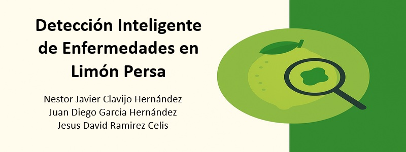

# Detección Inteligente de Enfermedades en Limón Persa

## Autores
- Nestor Javier Clavijo Hernández
- Juan Diego Garcia Hernández
- Jesus David Ramirez Celis

## Objetivo
Desarrollar un sistema automatizado que detecte de manera temprana enfermedades en limón persa, facilite decisiones en campo y sea escalable y replicable.

## Dataset
- **Enlace**: [Dataset en Roboflow](https://universe.roboflow.com/mafer-6tca8/enfermedades-en-limon-persa/browse?queryText=&pageSize=50&startingIndex=0&browseQuery=true)
- **Descripción**: Conjunto de imágenes de limones persas con distintas enfermedades, etiquetadas para tareas de detección con YOLO. Incluye varias clases relevantes para la agricultura de precisión.

## Modelos
yolov8, yolov9, yolov11

## Enlaces Relevantes

- 🎞️ **Video de Presentación**: [Enlace](https://www.youtube.com/watch?v=TSZXRuHpod0)
- 📂 **Archivo de Video**: [video_presentacion](./videito.mkv)
- 📑 **Diapositivas**: [Ver presentación en Canva](https://www.canva.com/design/DAGi1-RdyLQ/VvPck8zFnK6_cdCoJbvOJw/edit?utm_content=DAGi1-RdyLQ&utm_campaign=designshare&utm_medium=link2&utm_source=sharebutton)
- 💻 **Código fuente / Notebook**: [Notebook en Google Drive](https://drive.google.com/file/d/1aVqAfGy_knRU6B2fjTeBhCYiXWYX9jym/view?usp=sharing)
